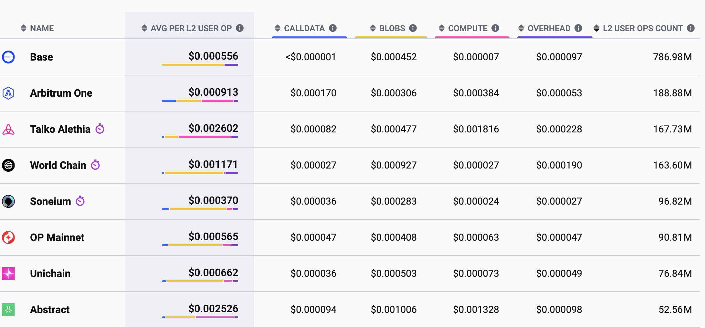

## Chain Economics

Fayçal Drissi

*University of Oxford*

 

These slides: [https://www.faycaldrissi.com/chaineconomics](https://www.faycaldrissi.com/chaineconomics)

<!--[my scholar](https://scholar.google.com/citations?user=njvyriQAAAAJ&hl=fr), 
[my website](https://www.faycaldrissi.com/), [my github](https://github.com/FDR0903)-->

---

# Overview

- Issuance, adoption, and staking 
- Layer 1 / Layer 2
- Block time and DeFi
- Private / Public order flow

---

      

<h1>
Issuance, adoption, and staking </h1>

---

# Issuance, adoption, and staking

* **Blockchains** are distributed digital ledgers that securely store and execute transactions 

---

# Issuance, adoption, and staking

* **Blockchains** are distributed digital ledgers that securely store and execute transactions 
* **Issuance** defines how Ethereum pays for this security

---

# Issuance, adoption, and staking

* **Issuance**: rewards distributed by the protocol to incentivize secure block production and validation
* These rewards are minted as new tokens and given to network participants who conduct consensus duties
$$\text{total supply of ETH} = \text{issuance} - \text{the burn (EIP-1559)}$$

---

# Issuance, adoption, and staking

* **Issuance**: rewards distributed by the protocol to incentivize secure block production and validation
* These rewards are minted as new tokens and given to network participants who conduct consensus duties
$$\text{total supply of ETH} = \text{issuance} - \text{the burn (EIP-1559)}$$

* Last 30 days  

$$78,277.28 \text{ ETH issued} \qquad  8,041.75 \text{ ETH burned}$$

*Source: ultrasound.money*

---

# Issuance, adoption, and staking
### Timeline of issuance

* **Jul 2015** Genesis: block reward set to 5 ETH (PoW miners were rewarded for producing blocks)
* **Oct 2017** Byzantium (EIP-649): block reward reduced to 3 ETH
* **Feb 2019** Constantinople (EIP-1234): block reward reduced to 2 ETH
* **Dec 2020** Beacon chain genesis: *Proof-of-Stake* issuance started
    - PoS rewards remain locked in the beacon chain  (not withdrawable)
* **Sep 2022** The Merge: Ethereum issuance is now only from PoS rewards (not withdrawable)
* **Apr 2023** Shanghai/Capella (EIP-4895): Withdrawals to the execution layer

---

# Issuance, adoption, and staking
### Today

* Since the beacon chain: issuance poliocy is determined by an **issuance curve**
*  parameterized curve that calculates the *yield* as a function of the amount of ETH staked
$$
\text{yield} = \frac{2.6 \cdot 64}{\sqrt{\text{staked ETH}}}
$$

{style="transform: translate(40%, 0%); width: 450px"}

---

# Issuance, adoption, and staking
### Rationale

$$
\text{yield} = \frac{2.6 \cdot 64}{\sqrt{\text{staked ETH}}}
$$

- Aim for 3.3% yield with 30 million ETH staked
- highly incentivizing at least 10 million staked ETH

{style="transform: translate(60%, 0%); width: 400px"}

---

# Issuance, adoption, and staking
### Today

- June 2025: Almost 35 out 120 million ETH staked (88.6 bn $); stake rate of $28.24\%$

{style="transform: translate(5%, 0%); width: 800px"}

---

# Issuance, adoption, and staking
### Today

- June 2025:  0.162 out of the 35 million ETH staked are by solo stakers

{style="transform: translate(40%, 0%); width: 500px"}

--- 

# Issuance, adoption, and staking
### Tomorrow: staking demand likely to increase
- ETH price appreciation
- US interest rates decline (Fed Fund $5.5\%$ to $4.5\%$ since Sep 2024, projected $3\%$)
- LST/LRT LST/LRT demand (Liquid staking tokens and liquid restaking tokens)
    * lower the barrier of entry to staking and help decentralize the validator set
    * EigenLayer quickly attracted over $11 billion TVL

---

# Issuance, adoption, and staking
### Research questions: What is a good issuance policy  ?

* Solana is at 85% stake rate, Cosmos is at 66%, Celestia at 55%
* More stake implies more economic security for Ethereum
  

### What's wrong with too much staking?

---

# Issuance, adoption, and staking
### Some answers

* Blockchain can be seen as **small open economy** within the US economy
* EF controls rewards (inflationary effect) and gas fees (deflationary effect)
* **Issuance policy** of an L1 blockchain is similar to **traditional monetary policy**

--- 

# Issuance, adoption, and staking
### Some answers

* Issuance does not create value: redistribution of wealth from non-stakers to stakers
* What generates value: non-staking
    * adoption
    * new technology (capital productivity, growth)
* Issuance is a **tax on non-stakers**
* **Issuance policy** of an L1 blockchain is similar to **fiscal policy**

---

# Issuance, adoption, and staking
### A simple macro model of issuance (Zach Feinstein, Basil Williams)
* Users essentially face a portfolio problem in a blockchain: dApps or staking

$$
\text{staking returns} = \text{issuance} + \text{MEV} - \text{slashing}
$$

$$
\text{dApps returns} = \text{adoption/growth} - \text{gasfees} - \text{MEV} - \text{issuance} + \text{risk}
$$

* Result: portion $\theta$ of USD wealth in dApps, $1-\theta$ in staking

---

# Issuance, adoption, and staking
### A simple macro model of issuance (Zach Feinstein, Basil Williams)

* The value of ETH, is a consequence of the demand for it

$$
\text{Price of ETH } \times \text{supply} = \text{USD wealth of users}
$$

---

# Issuance, adoption, and staking
### A simple macro model of issuance (Zach Feinstein, Basil Williams)

* Assume 
$$
\text{growth =  }30\%
$$

* Outcomes
{style="transform: translate(5%, 0%); width: 800px"}

* **Tradeoff between adoption and staking**

---

# Issuance, adoption, and staking
### A simple macro model of issuance (Zach Feinstein, Basil Williams)

* What's wrong with issuance curves: targetting a yield, as a function of total staked ETH, does not guarantee economic security

* **Policy**: target a level $T$ of economic security: USD value of staked ETH
    $$
    \text{Optimal policy} = F\left(\text{growth}, \text{ETH price}, \text{supply}, \text{risk}, ...\right)
    $$

---

# Issuance, adoption, and staking
### Policy objectives beyond economic security
* minimize ETH volatility (store of value)
* tradeoff adoption and security
* user welfare
* how to decentralize the validator set ?
* maximize the value of ETH
    * strong ETH $\implies$ more effective monetary policy

---

      

<h1>
Layer 2 blockchains </h1>

---

# Layer 1 / Layer 2
### Introduction

- L1 blockchain faces scalability challenges 
- rollup-centric ethereum roadmap (2020): big push for development of Layer-2 (L2) solutions
- Rollups are L2s that periodically post state commitments to Ethereum
- Commitments are validated by either
    * validity proofs
    * optimistic accept (can be challenged via Fraud Proof mechanism)

---

# Layer 1 / Layer 2
{style="transform: translate(40%, 0%); width: 500px"}
*Source: Mike Neuder's Blob gossip and validation before and after PeerDAS*
* user submits L2 transaction to the centralized sequencer
* sequencer immediately confirms the transaction
* sequencer batches many L2 transactions into an L1 blob
* they submit to the public mempool
* Ethereum builder/proposer include in a block + publishes the block to the consensus layer
* user receives second confirmation

---

# Layer 1 / Layer 2
- Almost $60$ Layer 2 projects
{style="transform: translate(30%, 0%); width: 500px"}
- Mainly horizental product differentitation

---

# Layer 1 / Layer 2
- Majority of Ethereum’s transaction activity has moved to L2 networks 
    - see Saleh et al. 2025
{style="transform: translate(20%, 0%); width: 600px"}
{style="transform: translate(20%, 0%); width: 600px"}

---

# Layer 1 / Layer 2
### Research question:  What are the economic effects of L2s on the ecosystem

---

# Layer 1 / Layer 2
### Some answers

* Users care about fast and cheap $\implies$ Layer 2 are good for adoption / scale DeFi
* L2s generate new wealth in the ecosystem
$$
\text{dApps returns} = \underbrace{\text{adoption/growth}}_{++} - \underbrace{\text{gasfees}}_{--} - \underbrace{\text{MEV}}_{--} - \text{issuance} + \underbrace{\text{risk}}_{==}
$$
$$
\text{staking returns} = \text{issuance} +  \underbrace{\text{MEV}}_{--} + \text{blob fees} - \text{slashing}
$$
* **Consequence**: more demand for ETH, higher prices, more effective issuance policies, etc..

---

# Layer 1 / Layer 2
### Some answers

* However, L2s increasingly use natively minted tokens and less birdged tokens

{style="transform: translate(5%, 0%); width: 800px"}

---

# Layer 1 / Layer 2
### Some answers

* Costs of L2s to use L1 are low

{style="transform: translate(15%, 0%); width: 700px"}

---

# Layer 1 / Layer 2
### Some answers

* **Consequence 1**: demand for ETH decreases instead of increasing
    * ETH prices decrease
    * economic security hard to achieve
* **Consequence 2**: issuance policy less (not) effective if policy objective involves L1/L2 interaction
    * Too much power for L2s over the ecosystem

---

# Layer 1 / Layer 2
###  Designing a policy for L1/L2 interaction (Zach Feinstein & Basil Williams)

* User preferences
    - L2 users' utility: don't care much about security
    - risks of using L2s: bridge contract, sequencer goes offline
    - L1 users care about security $\implies$ large transactions are on the L1 

---

# Layer 1 / Layer 2
###  Designing a policy for L1/L2 interaction (Zach Feinstein & Basil Williams)

* Policy tools
    - blob fees
    - requirement to use ETH as currency
* Policy risks
    * L2 becomes a competing L1
    * L1 becomes a data availability layer $\implies$ competition with DAs  
        *MegaETH posts proofs to Ethereum but uses EigenDA to publish data*
* Policy objectives
    - control for decentralization 

---

      

<h1>
Block time </h1>

---

# Blockchain protocol
The blockchain protocol determines the lifecycle of transactions and adds new cost structures

* Transactions are sent to the network continuously, and stored in a memory pool
   

{style="transform: translate(20%, 0%); width: 680px"}

---

# Blockchain protocol
The blockchain protocol determines the lifecycle of transactions and adds new cost structures

* Transactions are sent to the network continuously, and stored in a memory pool
* At each Epoch, with length block time, a validator is chosen
  

{style="transform: translate(20%, 3%); width: 680px"}

---

# Blockchain protocol
The blockchain protocol determines the lifecycle of transactions and adds new cost structures

* Transactions are sent to the network continuously, and stored in a memory pool
* At each Epoch, with length block time, a validator is chosen
* The validator creates a new block with transactions from the memory pool

{style="transform: translate(20%, 0%); width: 680px"}

--- 

# Block time: ‘EIP-7781’

* Ethereum proposal ‘EIP-7781’ calls for slot time reduction from 12 to 8 seconds 
    * boost transaction throughput
    * "make DEXs 1.22 times more efficient and save around $100 million annually from CEX/DEX arbitrage"

---

# Block time 
### Research question: effect of block time on
- market efficiency
- cost of liquidity
- trading volumes

---

# Block time 
### Some answers: economic effects of block time
* Assume DEX is the main exchange
* Longer block times increase speculative rewards
   *  incentive to acquire private information $\implies$ DEX prices more efficient
* Longer block times incraese adverse selection costs for LPs
   *  defensive reduction of liquidity
* Longer block times incraese competition for queue priority
   * higher liquidity supply
* Longer block times give time for noise trading to accumulate
   * higher liquidity supply

---

# Block time 
### Some answers (Capponi, Cartea, Drissi (2025))
* Illiquid markets, expensive information: there is a threshod for block time beyond which markets shut down

{style="transform: translate(70%, 0%); width: 350px"}

---

# Block time 
### Some answers (Capponi, Cartea, Drissi (2025))

* Liquid markets (noise traders accumulate), cheap information
{style="transform: translate(70%, 0%); width: 350px"}

---

# Block time 
### Some answers
* Short block time $\neq$ better DeFi 
* Protocol design focus should be on fair competition for queue priority
* Short block time $\equiv$ Validators would need to perform their duties more frequently, potentially requiring more powerful hardware to keep up with the increased pace. That would particularly impact solo stakers

---

      

<h1>
Private / Public Order Flow  </h1>

---

# Private / Public Order Flow

* Ethereum users face a frontrunning threat by MEV searchers
* private endpoints emerged to act as a protective measure for the users
* POF allows users to send their transactions directly to miners, validators, or trusted third-party providers

---

# Examples

* Flashbots Protect: bypassing the public mempool and send directly to miners from a whitelist. 
    * users may experience slow transaction processing
* Order flow auctions: mechanism to sell MEV rights with a sealed-bid auction
    * OFA providers groups orders, searchers participate in an auction to gain backrunning right
    * After the user’s transaction is included in a block, the user receives refunds

---

# Private order flow

* Configuration that maximises welfare of users: $100\%$ of order flow is private
    * users do not suffer from MEV attacks
    * information is private $\implies$ competition under uncertainty $\implies$ low priority fees

---

# Private order flow

* Configuration that maximises welfare of users: $100\%$ of order flow is private
    * users do not suffer from MEV attacks
    * information is private $\implies$ competition under uncertainty $\implies$ low priority fees
* However, builders decide where to allocate validation power

---

# Private order flow: theory
* It is optimal, in equilibrium, for builders to split between private and public
    * extract fees from **patient users** that avoid MEV
    * extract MEV from **impatient users** that compete in the public memory pool for quick execution

---

# Private order flow: practice
{style="transform: translate(20%, 0%); width: 600px"}

---

# Private order flow: practice
{style="transform: translate(20%, 0%); width: 600px"}

* By having access to exclusive order flows, validators gain informational advantages over other network participants $\implies$ better MEV 
* Competition for POF: competition for informational advantage

---
layout: end
---

Thank you !

[faycaldrissi.com](https://www.faycaldrissi.com/)

---

# Private order flow: practice
{style="transform: translate(20%, 0%); width: 600px"}

* By having access to exclusive order flows, validators gain informational advantages over other network participants $\implies$ better MEV 
* Enhanced access allows them to construct blocks that include more transactions and capture more lucrative MEV opportunities compared to their competitors

---
layout: end
---

Thank you !

[faycaldrissi.com](https://www.faycaldrissi.com/)
